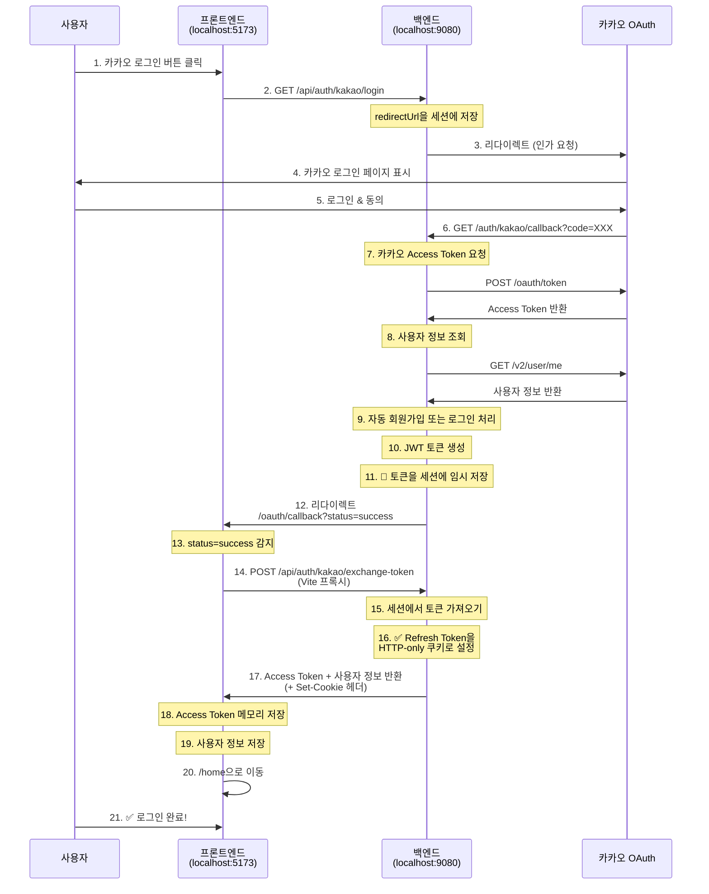

# 카카오 로그인 구현 가이드 (백엔드)

## 📌 개요

Spring Boot 백엔드에서 카카오 OAuth 2.0 로그인을 구현하고, **Cross-Port 쿠키 문제**를 해결한 방법을 설명합니다.

### 주요 특징
- ✅ **하이브리드 토큰 전송**: 웹(쿠키) vs 모바일(JSON)
- ✅ **Cross-Port 쿠키 문제 해결**: 세션 기반 토큰 교환
- ✅ **보안**: HTTP-only 쿠키 + XSS 방어
- ✅ **자동 회원가입**: 첫 로그인 시 자동으로 회원 생성

---

## 🔐 Cross-Port 쿠키 문제란?

### 문제 상황

```
백엔드: localhost:9080
프론트엔드: localhost:5173 (Vite 개발 서버)

문제:
- OAuth callback이 localhost:9080에서 처리됨
- 쿠키를 localhost:9080에 설정
- 프론트엔드(localhost:5173)로 리다이렉트
- 프론트엔드가 /api/refresh 호출 (Vite 프록시 → localhost:9080)
- ❌ 브라우저는 쿠키를 전송하지 않음 (포트가 다르므로)
```

### 해결 방법

**세션 기반 토큰 교환 패턴**을 도입했습니다:

```
1. OAuth callback에서 토큰을 세션에 임시 저장
2. 프론트엔드로 리다이렉트 (status=success)
3. 프론트엔드가 Vite 프록시를 통해 /auth/kakao/exchange-token 호출
4. 백엔드가 세션에서 토큰을 가져와 쿠키로 설정
5. ✅ 쿠키가 정상적으로 전송됨 (Vite 프록시를 통한 요청이므로)
```

---

## 🚀 카카오 로그인 전체 플로우



---

## 📝 주요 코드 설명

### 1. 카카오 로그인 시작 (`GET /auth/kakao/login`)

**파일**: `KakaoAuthController.java` (Line 103-120)

```java
@GetMapping("/login")
public void kakaoLogin(
    @RequestParam(required = false) String redirectUrl,
    HttpSession session,
    HttpServletResponse response
) throws IOException {
  // 프론트엔드에서 전달한 redirectUrl을 세션에 저장
  if (redirectUrl != null && !redirectUrl.isBlank()) {
    session.setAttribute("kakaoRedirectUrl", redirectUrl);
  }

  // 카카오 인가 코드 요청 URL 생성
  String authorizationUrl = kakaoOAuthService.getAuthorizationUrl();

  // 카카오 로그인 페이지로 리다이렉트
  response.sendRedirect(authorizationUrl);
}
```

**역할**:
- 프론트엔드가 전달한 `redirectUrl`을 세션에 저장 (OAuth 완료 후 리다이렉트할 URL)
- 카카오 인가 페이지로 사용자를 리다이렉트

---

### 2. 카카오 OAuth 콜백 처리 (`GET /auth/kakao/callback`)

**파일**: `KakaoAuthController.java` (Line 122-237)

#### 2-1. 세션에서 redirectUrl 복원

```java
@GetMapping("/callback")
public void kakaoCallback(
    @RequestParam String code,
    HttpServletRequest request,
    HttpServletResponse response
) throws IOException {
  try {
    // 0️⃣ 세션에서 프론트엔드 redirectUrl 가져오기
    HttpSession session = request.getSession(false);
    String frontendRedirectUrl = null;

    if (session != null) {
      frontendRedirectUrl = (String) session.getAttribute("kakaoRedirectUrl");
      if (frontendRedirectUrl != null) {
        session.removeAttribute("kakaoRedirectUrl");
      }
    }

    // redirectUrl이 없으면 기본 설정값 사용
    if (frontendRedirectUrl == null || frontendRedirectUrl.isBlank()) {
      frontendRedirectUrl = appProperties.getOauth().getKakaoRedirectUrl();
    }
```

**역할**: 이전에 저장한 `redirectUrl`을 복원하여 OAuth 완료 후 올바른 페이지로 리다이렉트

---

#### 2-2. 카카오 토큰 요청 및 사용자 정보 조회

```java
    // 2️⃣ Authorization Code로 카카오 Access Token 요청
    KakaoOAuthDto.TokenResponse tokenResponse = kakaoOAuthService.getAccessToken(code);

    // 3️⃣ 카카오 Access Token으로 사용자 정보 조회
    KakaoOAuthDto.UserInfoResponse kakaoUserInfo =
        kakaoOAuthService.getUserInfo(tokenResponse.getAccessToken());

    // 4️⃣ 카카오 사용자 정보로 로그인 처리 (자동 회원가입 포함)
    LoginResponse loginResponse = kakaoOAuthService.processKakaoLogin(kakaoUserInfo);
```

**역할**:
- 카카오로부터 받은 인가 코드(`code`)를 Access Token으로 교환
- Access Token으로 카카오 사용자 정보 조회
- 자동 회원가입 또는 로그인 처리 → JWT 토큰 생성

---

#### 2-3. 🔑 토큰을 세션에 임시 저장 (핵심 변경)

```java
    // 5️⃣ 웹 클라이언트면 토큰을 세션에 저장하고 프론트엔드로 리다이렉트
    if (isWebClient) {
      // 🔒 Cross-Port 쿠키 문제 해결:
      // OAuth callback은 localhost:9080에서 처리되지만, 쿠키를 여기서 설정하면
      // localhost:5173의 프론트엔드에서 접근할 수 없음
      // 따라서 토큰을 세션에 임시 저장하고, 프론트엔드가 /exchange-token을 호출하여
      // Vite 프록시를 통해 쿠키를 받도록 변경

      HttpSession sessionForToken = request.getSession(true);
      sessionForToken.setAttribute("pendingLoginResponse", loginResponse);

      // 프론트엔드로 리다이렉트 (status=success로 전달)
      String successRedirectUrl = String.format("%s?status=success", frontendRedirectUrl);

      response.sendRedirect(successRedirectUrl);
    }
```

**변경 전** (문제):
```java
// ❌ 쿠키를 여기서 직접 설정하면 localhost:9080에 쿠키가 설정됨
Cookie refreshTokenCookie = new Cookie("refreshToken", loginResponse.getRefreshToken());
response.addCookie(refreshTokenCookie);

// 프론트엔드로 리다이렉트
response.sendRedirect("http://localhost:5173/oauth/callback?status=success");

// 문제: 프론트엔드가 /api/refresh를 호출해도 쿠키가 전송되지 않음 (포트가 다름)
```

**변경 후** (해결):
```java
// ✅ 토큰을 세션에 임시 저장
session.setAttribute("pendingLoginResponse", loginResponse);

// 프론트엔드로 리다이렉트
response.sendRedirect("http://localhost:5173/oauth/callback?status=success");

// 프론트엔드가 /exchange-token을 호출하면 그때 쿠키 설정
```

---

### 3. 🆕 토큰 교환 엔드포인트 (새로 추가됨!)

**파일**: `KakaoAuthController.java` (Line 44-91)

```java
/**
 * 토큰 교환 엔드포인트 (Cross-Port 쿠키 문제 해결용)
 * OAuth callback에서 세션에 저장한 토큰을 가져와 HTTP-only 쿠키로 설정
 * 이 엔드포인트는 프론트엔드가 Vite 프록시를 통해 호출하므로 쿠키가 정상 작동함
 */
@PostMapping("/exchange-token")
public ResponseEntity<ApiResponse<LoginResponse>> exchangeToken(
    HttpServletRequest request,
    HttpServletResponse response
) {
  // 1️⃣ 세션에서 대기 중인 LoginResponse 가져오기
  HttpSession session = request.getSession(false);
  if (session == null) {
    return ResponseEntity
        .status(401)
        .body(ApiResponse.error("세션이 만료되었습니다. 다시 로그인해주세요."));
  }

  LoginResponse loginResponse = (LoginResponse) session.getAttribute("pendingLoginResponse");
  if (loginResponse == null) {
    return ResponseEntity
        .status(401)
        .body(ApiResponse.error("로그인 정보가 없습니다. 다시 로그인해주세요."));
  }

  // 2️⃣ 세션에서 제거 (일회용)
  session.removeAttribute("pendingLoginResponse");

  // 3️⃣ Refresh Token을 HTTP-only 쿠키로 설정
  Cookie refreshTokenCookie = new Cookie("refreshToken", loginResponse.getRefreshToken());
  refreshTokenCookie.setHttpOnly(true);   // JavaScript 접근 불가 (XSS 방어)
  refreshTokenCookie.setSecure(appProperties.getCookie().isSecure());  // 환경별 동적 설정
  refreshTokenCookie.setPath("/");        // 모든 경로에서 쿠키 전송
  refreshTokenCookie.setMaxAge(7 * 24 * 60 * 60); // 7일 (초 단위)

  response.addCookie(refreshTokenCookie);

  // 4️⃣ 응답 바디에서 Refresh Token 제거 (보안 강화)
  loginResponse.setRefreshToken(null);

  // 5️⃣ Access Token과 사용자 정보 반환
  return ResponseEntity.ok(ApiResponse.success("토큰 교환 성공", loginResponse));
}
```

**역할**:
- 세션에 저장된 토큰을 가져와 HTTP-only 쿠키로 설정
- **Vite 프록시를 통해 호출되므로 쿠키가 정상적으로 작동**
- 일회용: 한 번 사용 후 세션에서 제거
- Access Token과 사용자 정보를 JSON으로 반환

**왜 여기서는 쿠키가 작동하는가?**

```
OAuth callback 경우 (문제):
카카오 → localhost:9080/auth/kakao/callback (쿠키 설정)
         → localhost:5173로 리다이렉트
         → localhost:5173에서 /api/refresh 호출 (Vite 프록시)
         → ❌ 쿠키가 localhost:9080에만 설정되어 있어 전송 안 됨

토큰 교환 경우 (해결):
localhost:5173에서 POST /api/auth/kakao/exchange-token 호출
         → Vite 프록시가 localhost:9080으로 전달
         → 백엔드가 Set-Cookie 헤더로 응답
         → ✅ 브라우저가 쿠키를 localhost:5173에 저장 (프록시 덕분)
```

---

## 🔄 전체 엔드포인트 요약

| 엔드포인트 | 메서드 | 역할 | 호출자 |
|-----------|--------|------|--------|
| `/auth/kakao/login` | GET | 카카오 로그인 시작 | 프론트엔드 |
| `/auth/kakao/callback` | GET | 카카오 OAuth 콜백 처리 | 카카오 |
| **`/auth/kakao/exchange-token`** | **POST** | **토큰 교환 (쿠키 설정)** | **프론트엔드** |
| `/refresh` | POST | Access Token 갱신 | 프론트엔드 |
| `/me` | GET | 현재 사용자 정보 조회 | 프론트엔드 |

---

## 🛡️ 보안 고려사항

### 1. HTTP-only 쿠키
```java
refreshTokenCookie.setHttpOnly(true);
```
- JavaScript에서 쿠키 접근 불가 → XSS 공격 방어

### 2. Secure 플래그 (환경별 설정)
```java
refreshTokenCookie.setSecure(appProperties.getCookie().isSecure());
```
- **개발 환경**: `false` (HTTP 허용)
- **프로덕션**: `true` (HTTPS만 허용)

### 3. 일회용 토큰 교환
```java
session.removeAttribute("pendingLoginResponse");
```
- 세션에 저장된 토큰은 한 번만 사용 가능
- 재사용 공격 방지

### 4. CORS 설정
```yaml
# application-dev.yaml
app:
  cors:
    allowed-origins:
      - http://localhost:5173
    allow-credentials: true  # 쿠키 전송 허용
```

---

## 📂 관련 파일

### 백엔드
- **컨트롤러**: `KakaoAuthController.java` (Line 44-91: 토큰 교환, Line 122-237: OAuth 콜백)
- **서비스**: `KakaoOAuthService.java` (카카오 API 호출, 자동 회원가입)
- **설정**: `application-dev.yaml` (CORS, 쿠키 설정)

### 프론트엔드
- **페이지**: `KakaoCallback.jsx` (Line 59-90: 토큰 교환 로직)
- **로그인**: `Login.jsx` (카카오 로그인 버튼)
- **설정**: `vite.config.js` (Vite 프록시 설정)

---

## 🎯 핵심 개념 요약

### 문제
- 백엔드(localhost:9080)와 프론트엔드(localhost:5173)의 포트가 달라 쿠키가 전송되지 않음

### 해결
1. **세션 기반 토큰 임시 저장**: OAuth callback에서 토큰을 세션에 저장
2. **토큰 교환 엔드포인트**: 프론트엔드가 Vite 프록시를 통해 호출
3. **Vite 프록시의 역할**: 브라우저 입장에서는 같은 origin으로 인식 → 쿠키 정상 작동

### 장점
- ✅ 보안: Refresh Token을 HTTP-only 쿠키로 안전하게 관리
- ✅ 호환성: Vite 개발 환경에서도 쿠키 기반 인증 작동
- ✅ 유연성: 프론트엔드 redirectUrl을 동적으로 설정 가능
- ✅ 확장성: 웹/모바일 하이브리드 방식 지원

---

## 🚀 프로덕션 배포 시 고려사항

프로덕션 환경에서는 백엔드와 프론트엔드가 **같은 도메인** 또는 **역방향 프록시**를 통해 서빙되므로, Cross-Port 문제가 발생하지 않습니다.

### 예시 1: 같은 도메인
```
https://example.com (프론트엔드 정적 파일)
https://example.com/api (백엔드 API)
```

### 예시 2: 서브도메인
```
https://app.example.com (프론트엔드)
https://api.example.com (백엔드)
```
- 이 경우 쿠키 Domain을 `.example.com`으로 설정

### 예시 3: Nginx 역방향 프록시
```nginx
server {
  location / {
    proxy_pass http://frontend:5173;
  }

  location /api {
    proxy_pass http://backend:9080;
  }
}
```

**결론**: 프로덕션에서는 토큰 교환 엔드포인트가 필요 없을 수 있지만, 개발 환경과 일관성을 위해 유지하는 것을 권장합니다.

---

## 📚 참고 자료

- [카카오 OAuth 2.0 문서](https://developers.kakao.com/docs/latest/ko/kakaologin/rest-api)
- [Spring Security 공식 문서](https://docs.spring.io/spring-security/reference/index.html)
- [HTTP-only 쿠키 보안](https://owasp.org/www-community/HttpOnly)

---

**작성일**: 2025-12-20
**버전**: 1.0.0
